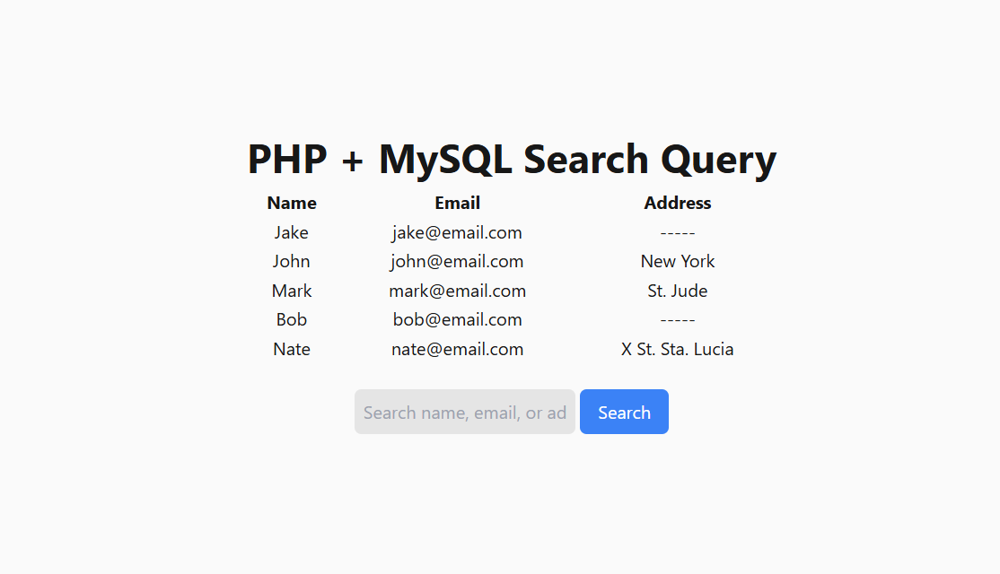

# PHP + MySQL Search Query
Simple search query within the database.

## Previews



## Setup
1. Go to you XAMPP htdocs directory (usually in `C:\xampp\htdocs`, depending on where you installed your XAMPP)
2. Clone this repository by running `git clone https://github.com/khianvictorycalderon/php-mysql-search-query.git`
3. Start Apache and MySQL from XAMPP control panel.
4. Go to your phpmyadmin panel and run this MySQL query:
    ```sql
    CREATE TABLE sample_users (
        id INT AUTO_INCREMENT PRIMARY KEY,
        name VARCHAR(200) NOT NULL,
        email VARCHAR(100) UNIQUE NOT NULL,
        address TEXT
    );

    INSERT INTO sample_users (name, email, address) VALUES
        ('Jake', 'jake@email.com',  NULL),
        ('John', 'john@email.com', 'New York'),
        ('Mark', 'mark@email.com', 'St. Jude'),
        ('Bob', 'bob@email.com', NULL),
        ('Nate', 'nate@email.com', 'X St. Sta. Lucia');
    ```
5. Go to your browser and run `localhost/php-mysql-search-query`
6. Enjoy!

---

## Prerequisites
- Apache
- MySQL Server
*I recommend using XAMPP as it comes with built-in Apache for PHP and MySQL Server.*